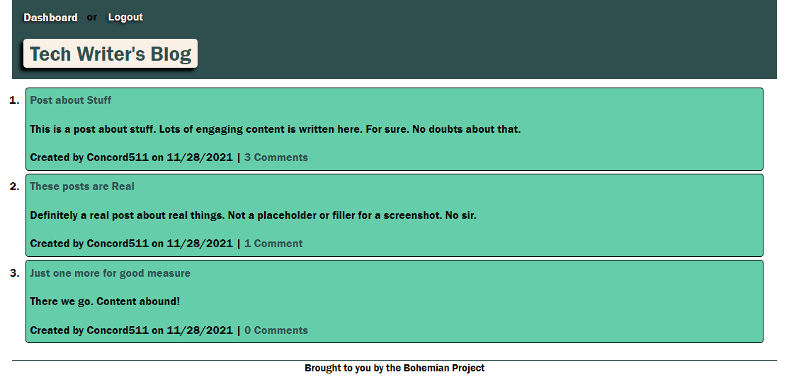

# Tech Writer Blog

## Table of Contents
* [Description](#description)
* [Installation](#installation)
* [Usage](#usage)
* [License](#license)
* [Contributing](#contributing)
* [Tests](#tests)
* [Questions](#questions)

## Description

This is a simple blog that allows for user creation and authentication, blog posts, and comments.

This project is deployed live at: https://powerful-shore-89983.herokuapp.com/

Screenshot 

## Installation

You will need to install using node.js. NPM dependancies are listed in package.json.

## Usage

When at the main page, you can view posts and comments as desired. To create your own posts or comments you will need to sign up, or sign in if you already have an account.

## License
This project is covered under the Unliscensed license: 

## Contributing

The project is technically finished, but contributions are always welcome.

## Tests

Insomnia Core was used to test routes, and a local server was used to test final functionality.

## Questions

Find me on GitHub: https://github.com/Concord511

Email me with questions: concord511@gmail.com
